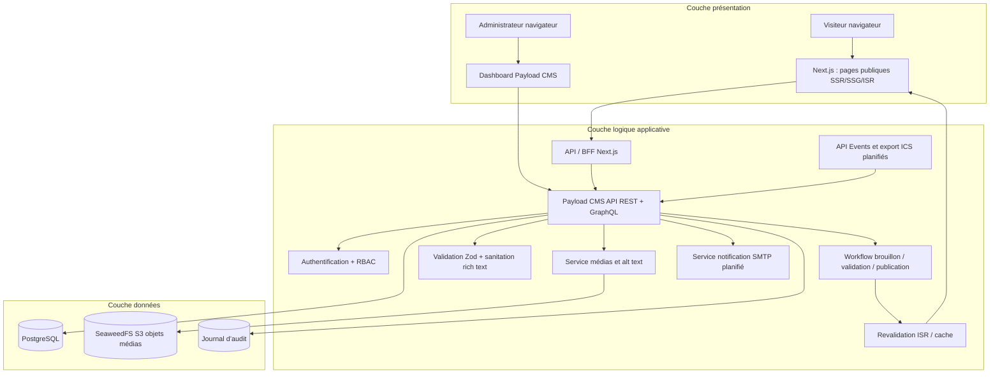
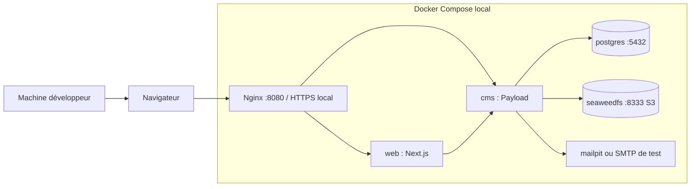
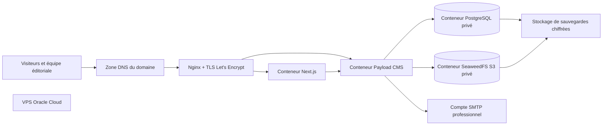
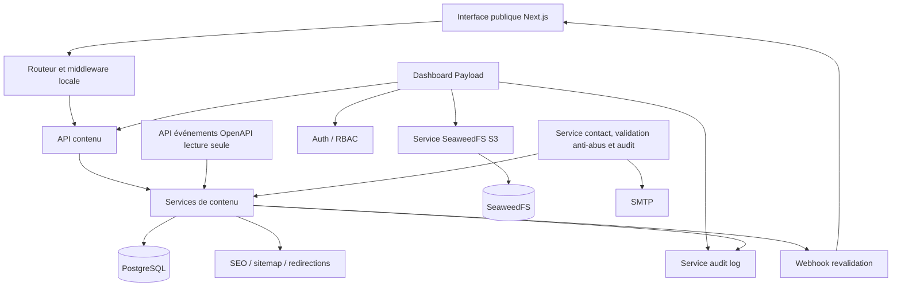
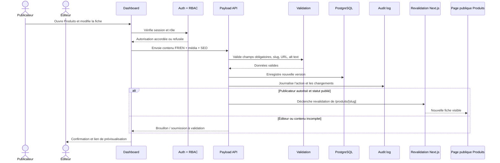
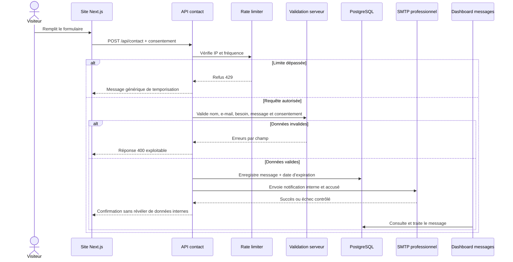
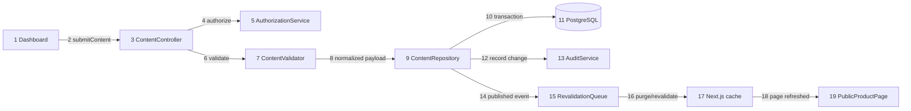
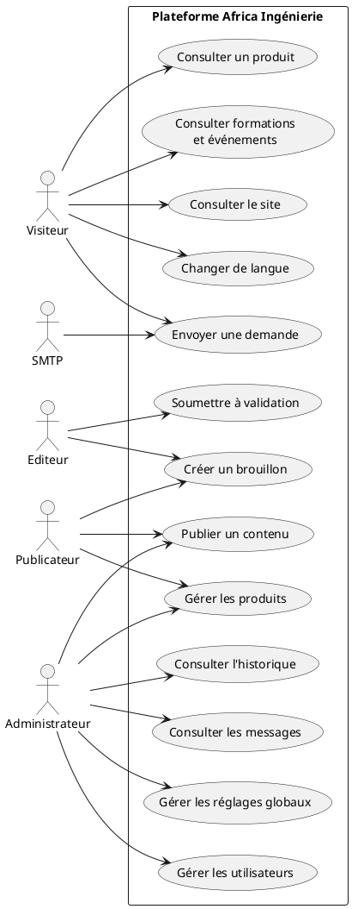

# Architecture, diagrammes UML et flux

> État au 28/08/2026 : les diagrammes distinguent les capacités implémentées
> des capacités planifiées. L'API événements, l'export ICS, la notification
> SMTP du contact et le rate limit applicatif du contact restent à réaliser.

## 1. Principes d’architecture

La plateforme est séparée en trois responsabilités : présentation, logique applicative et données. Le site public ne lit jamais directement PostgreSQL. Toute donnée passe par les services applicatifs et les règles de publication de Payload.

## 2. Diagramme de déploiement

### 2.1 Développement local

### 2.2 Production Oracle Cloud Free Tier

Règles de déploiement : PostgreSQL et SeaweedFS ne sont jamais exposés sur Internet ; seuls Nginx et les ports strictement nécessaires sont publics. Le DNS pointe vers le VPS uniquement après validation du serveur et du certificat.

## 3. Diagramme de composants UML

## 4. Séquence UML  -  publication d’un produit

## 5. Séquence UML  -  visiteur et formulaire de contact

> Cette séquence décrit le flux implémenté. La notification SMTP réelle reste
> un contrôle de recette dépendant des identifiants de production.

## 6. Diagramme de collaboration UML

Le scénario ci-dessous décrit la communication entre objets lors d’une publication.

## 7. Flux de données

| Flux | Entrée | Traitement | Sortie | Contrôles |
|---|---|---|---|---|
| Contenu éditorial | Formulaire dashboard | Auth, validation, sanitation, versioning | Brouillon ou contenu publié | RBAC, champs requis, audit |
| Média | Upload image/document | Taille, MIME, nom sûr, alt text, stockage SeaweedFS/S3 | URL média signée ou publique contrôlée | Extension autorisée, droits, antivirus si disponible |
| Site public | Requête HTTP | Next.js lit l’API/CMS et utilise ISR | HTML, métadonnées, JSON-LD | Cache, locale, statut publié |
| Publication | Action publicateur/admin | Transaction DB + événement de revalidation | Page publique actualisée | Audit, cohérence et rollback |
| Contact | Formulaire visiteur | Validation, consentement, anti-abus et audit ; SMTP à vérifier en recette | Message DB | Conservation limitée |
| Événements API | Requête lecture seule | Projection des événements publiés, locale, pagination et cache | JSON ou ICS | Aucun paiement ni billetterie |
| Réglages globaux | Dashboard administrateur | Validation singleton | Navigation, footer, cookies, SEO | Administrateur uniquement |

## 8. Spécification des cas d’utilisation

## 9. Scénarios détaillés

### UC-01  -  Publier un produit

1. L’utilisateur autorisé ouvre le module Produits.
2. Il crée ou modifie la fiche en français et en anglais.
3. Le système vérifie le slug, la catégorie, la disponibilité, le contenu, l’alt text et le SEO.
4. Le publicateur publie ; l’éditeur soumet à validation.
5. Le système enregistre une version et une entrée d’audit.
6. Next.js est revalidé.
7. Le produit apparaît dans `/produits` et `/produits/[slug]`.

### UC-02  -  Modifier les réglages globaux

1. L’administrateur ouvre Réglages généraux.
2. Il modifie logo, navigation, langues, coordonnées, réseaux, textes légaux ou SEO.
3. Le système valide chaque URL et chaque champ sensible.
4. La modification est enregistrée dans une transaction.
5. Les pages publiques sont revalidées.

### UC-03  -  Envoyer un message

1. Le visiteur remplit les champs obligatoires et accepte la politique de confidentialité.
2. Le serveur applique la validation. Le rate limiting applicatif reste à ajouter.
3. Le message est enregistré avec une date d’expiration.
4. Une notification SMTP sera envoyée après livraison du service de notification.
5. Le visiteur reçoit une confirmation générique.

### UC-04  -  Gérer les comptes

1. Seul l’administrateur peut créer, suspendre ou modifier un compte.
2. Le rôle est choisi parmi Administrateur, Publicateur et Éditeur.
3. Le système force l’activation initiale par lien à usage unique.
4. Le mot de passe n’est jamais visible dans le dashboard ni dans les logs.
5. Toute action est auditée.
