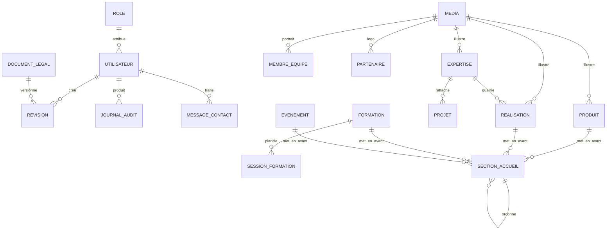

# MCD et MLD  -  Africa Ingénierie

> Statut au 28/08/2026 : le MCD reste la vue métier et le MLD décrit la cible
> relationnelle. Pour le schéma réellement exécuté, les migrations Payload de
> `apps/cms/src/migrations/` sont la source d'autorité. En particulier, le rôle
> est actuellement un enum `users.role` et le versionnage est porté par les
> tables natives Payload, pas par une collection métier autonome `roles` ou
> `revisions`.

## 1. Périmètre du modèle

Le modèle sépare les contenus éditoriaux, les réglages transverses, les utilisateurs, les médias, les demandes de contact et la traçabilité. Les textes bilingues sont stockés dans des colonnes FR/EN explicites afin d’éviter les traductions orphelines.

## 2. MCD  -  entités principales

### Entités

- `UTILISATEUR` : identité et état d’un compte du dashboard.
- `ROLE` : Administrateur, Publicateur ou Éditeur.
- `REGLAGES_SITE` : singleton de marque, contact, langue et cookies.
- `ELEMENT_NAVIGATION` : entrée de menu hiérarchique.
- `SECTION_ACCUEIL` : bloc affichable et ordonnable de la page d’accueil.
- `EXPERTISE`, `PROJET`, `REALISATION`, `FORMATION`, `EVENEMENT`, `PRODUIT` : contenus métier publiables.
- `SESSION_FORMATION` : occurrence planifiée d’une formation.
- `MEMBRE_EQUIPE`, `PARTENAIRE`, `TEMOIGNAGE` : contenus institutionnels.
- `MEDIA` : fichier géré par la médiathèque.
- `MESSAGE_CONTACT` : demande reçue depuis le site public.
- `DOCUMENT_LEGAL` : mentions légales ou confidentialité.
- `REDIRECTION` : ancienne URL vers une URL canonique.
- `REVISION` : version éditoriale d’un contenu.
- `JOURNAL_AUDIT` : événement de sécurité et de traçabilité.

### Diagramme entité-association

La relation entre `SECTION_ACCUEIL` et les contenus mis en avant est matérialisée dans le MLD par des tables de liaison dédiées. Le diagramme simplifie ces relations pour rester lisible.

## 3. MLD  -  tables et clés

### Sécurité et administration

| Table | Clé primaire | Clés étrangères | Rôle |
|---|---|---|---|
| `roles` | `id` |  -  | Référentiel des rôles |
| `users` | `id` | `role_id → roles.id` | Comptes dashboard |
| `audit_logs` | `id` | `actor_id → users.id` | Journal immuable |
| `revisions` | `id` | `created_by → users.id` | Historique des versions |

### Réglages et présentation

| Table | Clé primaire | Clés étrangères | Rôle |
|---|---|---|---|
| `site_settings` | `id` singleton | `logo_media_id`, `favicon_media_id → media_assets.id` | Réglages transverses |
| `social_links` | `id` |  -  | Réseaux sociaux facultatifs |
| `navigation_items` | `id` | `parent_id → navigation_items.id` | Menu public |
| `homepage_sections` | `id` |  -  | Sections accueil |
| `homepage_products` | `(section_id, product_id)` | vers sections et produits | Mise en avant produits |
| `homepage_realisations` | `(section_id, realisation_id)` | vers sections et réalisations | Mise en avant réalisations |
| `homepage_formations` | `(section_id, formation_id)` | vers sections et formations | Mise en avant formations |
| `homepage_events` | `(section_id, event_id)` | vers sections et événements | Mise en avant événements |

### Contenus métier

| Table | Clé primaire | Clés étrangères | Rôle |
|---|---|---|---|
| `expertises` | `id` | `media_id → media_assets.id` | Domaines d’expertise |
| `projects` | `id` | `expertise_id → expertises.id` | Projets planifiés/en cours |
| `realisations` | `id` | `expertise_id`, médias | Études de cas |
| `formations` | `id` |  -  | Catalogue de formation |
| `formation_sessions` | `id` | `formation_id → formations.id` | Sessions |
| `events` | `id` |  -  | Événements descriptifs |
| `products` | `id` | `media_id → media_assets.id` | Produits et équipements |
| `team_members` | `id` | `portrait_media_id → media_assets.id` | Équipe dirigeante |
| `partners` | `id` | `logo_media_id → media_assets.id` | Partenaires |
| `testimonials` | `id` | `portrait_media_id → media_assets.id` | Témoignages consentis |

### Support, conformité et SEO

| Table | Clé primaire | Rôle |
|---|---|---|
| `media_assets` | `id` | Fichiers, alt text, droits |
| `contact_messages` | `id` | Messages et consentements |
| `legal_documents` | `id` | Mentions et politique de confidentialité |
| `redirects` | `source_path` | Redirections 301 |

## 4. Politique de traduction

Les colonnes éditoriales publiques suivent le suffixe `_fr` ou `_en` : `title_fr`, `title_en`, `summary_fr`, `summary_en`, etc. Le statut de publication est commun au contenu, tandis que la complétude de chaque locale est contrôlée avant affichage.

Les champs suivants ne doivent pas être traduits dans la base : slug canonique, statut, dates, coordonnées numériques, ordre, identifiants et paramètres techniques.
